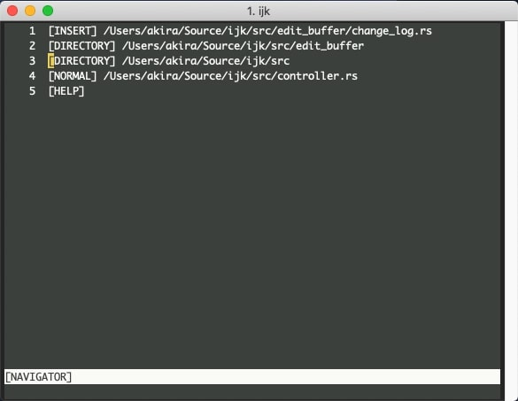
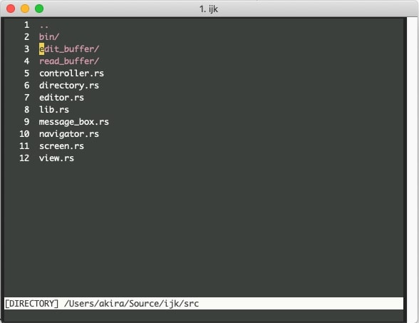
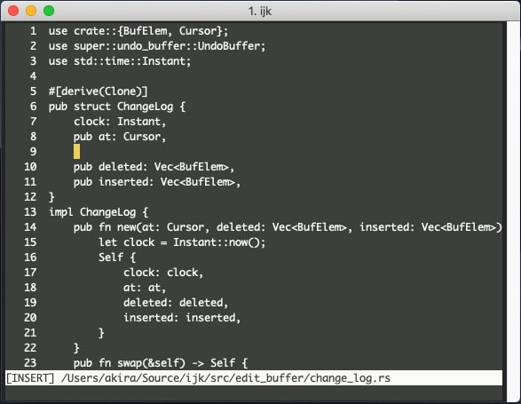

# ijk

A real editor for real programmers.

## Design Doc

[Design Doc](https://docs.google.com/presentation/d/1_oQ_Dryehfi-3vBBCQI_AFZDrvxvXp-LToMcWNIehPM/edit?usp=sharing)

## Screenshots

Navigator is the central part of ijk. You can go there anytime you press C-w.

In directory page, you can open files and directory. Quick access to the latest directory page from navigator page is just press j.

Buffer page is where you edit your file. The commands are similar to vi but customized as to be specialized for programming. Similar to directory page, quick access to the latest buffer page from navigator page is just press l.

## Tasks

- [ ] Syntax highlighting (probably the syntect is a good choice)
- [ ] Integration with language server
- [ ] Integration with Git
- [x] Automated benchmarking (using flamer is planned) and performance optimization
